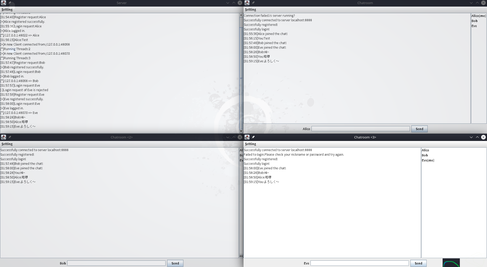

# Simple Chatroom

A chatroom in Java, using Swing GUI.



Usage:

```shell
javac -cp src -d bin src/chatroomGUI/ServerGUI.java src/chatroomGUI/Client.java

# Start the server
java -cp bin chatroomGUI.ServerGUI 
# Or: 
# java -cp bin chatroom.Server
# To get some help for more args:
# java -cp bin chatroom.Server -h

# Start the client
java -cp bin chatroomGUI.Client
```

## 简介

先完成简单的服务-客户端通信。服务端使用 ServerSocket 在默认端口 8888 监听， accept() 用来接受连接并返回一个 socket。通过这个 socket 可获得输入流输出流

```java
is = socket.getInputStream();// 获取字节输入流 
isr = new InputStreamReader(is);// 将字节流包装成字符流 
br = new BufferedReader(isr);// 为字符流添加缓冲 
os = socket.getOutputStream();// 获取字节输出流 
pw = new PrintWriter(os);// 打印输出流
```

客户端在 init()中，用 (SocketAddress endpoint, int timeout) 连接，然后相同地操作获取输入输出方式。
之后用 pw.write(msg)， br.readline()即可传输信息。
服务端为了与多个客户端连接，需要分别创建线程。自定义类 class ServerThread extends Thread 然后定义 run()。每个 ServerThread 示例加入一个 ArrayList存放。

```java
while (true){
socket = serverSocket.accept();
ServerThread serverThread = new ServerThread(socket);//创建一个新的线
程
threads.add(serverThread);
serverThread.start();//启动线程
count ++;
}
```

建立好连接后服务器端便准备接受客户端的信息。为区分登录与注册，在注册信息前加上“$”。
服务器接受后与本地存储的数据比较，如果是注册请求则比较用户名是否已被注册，若是则发送 $3代表注册成功并加入数据;若否则发送 $4代表拒绝注册。如果是登录请求则与数据库条目比较，若有吻合则发送 $1代表登录成功;若无吻合条目则发送 $2代表登录失败。
注册、 登录信息的发送通过用加号连接两信息实现，解析时用 split即可方便地分开。
一旦登录成功，双方即进入下一阶段:聊天接收与发送。客户端一边发送一边监听，服务器接受后广播该信息。
通信结束后需要释放连接，可用 shutdownInput() shutdownOutput()来结束输入输出，对上述各 reader writer用 close()，再 socket.close()。

本项目类的构成:Server类用于实现服务器功能，包含内部类 ServerThread来做主要的通信功能，其信息输出在终端;ServerGUI在此基础上实现图形界面。
Client类实现图形界面的客户端。 ServerGUI与 Client属于包 chatroomGUI，Server类属于包 chatroom。还有一个包 chatroomUtils存放一些功能类，包括一个 ArgsParser.java用于参数解析。
